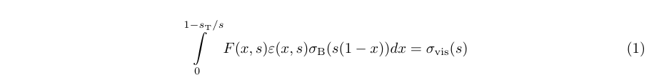
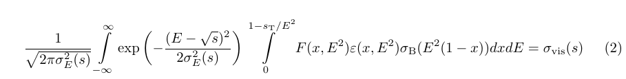
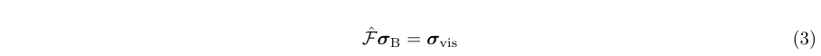

## Overview

The ISRSolver toolkit is a set of utilities for obtaining the Born cross section using the visible cross section data, as well as a set of utilities for checking the results. The Born cross section can be found using various methods. Some these methods are generally accepted, while other methods, such as the naive method and the Tikhonov regularization method, were first proposed for finding the Born cross section using the visible cross section data in article [] and then implemented in the ISRSolver toolkit.

The utilities are available to the user in a form of executable files that can be run with a set of command line options. The ISRSolver can be also used in a custom C++ or Python project.

## Quick start using Docker
1. Install and setup docker and docker-compose
2. Make sure the Docker service is running. You can do this using systemctl, for example:
  ```console
  systemctl status docker.service
  ```
3. Go to the directory where you want to download the ISRSolver source code and run the following console commands:
  ```console
  git clone https://github.com/sergeigribanov/ISRSolver
  cd ISRSolver/docker
  mkdir shared
  docker-compose up -d
  ```
4. After running the previous commands, check that the isrsolver_isrsolver image is in the list of images: 
  ```console
  docker images
  ```
5. Make sure the isrsolver_isrsolver_1 container is running:
  ```console
  docker ps
  ```
6. Find out the ip-address of the container isrsolver_isrsolvr_1:
  ```console
  docker inspect isrsolver_isrsolver_1
  ```
7. Connect to Jupiter Notebook using your internet browser. In order to do this, use the ip-address from the last point and port 8765. For example, if the ip-address is 172.22.0.2, then you should enter the following URL request in the browser: 172.22.0.2:8765.
 
**TO-DO: Describe how to run noteboks and how to use the docker container**

## Installation
1. Make sure that packages [ROOT](https://root.cern "ROOT - Data Analysis Framework") (```C++11```), [GSL](https://www.gnu.org/software/gsl "GSL - GNU Scientific Library"), [Eigen 3](https://eigen.tuxfamily.org/index.php?title=Main_Page "Eigen - C++ template library for linear algebra"), [Boost](https://www.boost.org "Boost - free peer-reviewed portable C++ source libraries"), [NLopt](https://nlopt.readthedocs.io/en/latest "NLopt - free/open-source library for nonlinear optimization"), [nlohmann_json](https://github.com/nlohmann/json "JSON for Modern C++") and [Minuit2 stand-alone](https://github.com/GooFit/Minuit2 "Stand-alone Minuit2") are installed.
2. In the following we assume that you have the following directory tree:
 - ```$HOME/source``` - the source code directory,
 - ```$HOME/build``` - the build directory,
 - ```$HOME/packages``` - the installation directory.

3. Download the ISRSolver source code:
  ```console
  git clone https://github.com/sergeigribanov/ISRSolver $HOME/source/ISRSolver
  ```
4. Create a directory ```$HOME/build/ISRSolver``` and change to it:
  ```console
  mkdir $HOME/build/ISRSolver
  cd $HOME/build/ISRSolver
  ```
5. Setup ```ROOT``` environment.
6. Run the following command:
  ```console
  cmake -DCMAKE_INSTALL_PREFIX=$HOME/packages/ISRSolver $HOME/source/ISRSolver
  ```
 Please note that smake sometimes cannot find some packages depending on how they were installed. If an error occurs that cmake cannot find a particular package, you should to run cmake with the appropriate options. **TO-DO: insert these commands and describe options**
7. Build and install:
  ```console
  make -j8
  make install
  ```

<!-- ## Relationship between Born and visible cross section -->
<!-- Precise measurement of the inclusive cross section of an e+e- annihilation to hadrons is -->
<!-- the main goal of the experiments carried out with the CMD-3 detector at the VEPP-2000 collider.  -->
<!-- This cross section is of interest in connection with the measurement of the fine structure constant  -->
<!-- and the problem of the muon anomalous magnetic moment. The inclusive cross section of an e+e-  -->
<!-- annihilation to hadrons is considered as the sum of the cross sections for exclusive processes  -->
<!-- of e+e- annihilation into different hadronic states. In the experiments carried out with the CMD-3  -->
<!-- detector, the visible cross section  -->
<!-- is measured, while the Born cross section  -->
<!-- is of interest. The visible and Born cross sections are related by the following integral equation: -->

<!--  -->

<!-- where  is a detection efficiency that depends on  -->
<!-- center-of-mass energy  and the energy fraction carried -->
<!-- away by initial state radiation (ISR). Equation (1) were first obtained by E.A. Kuraev amd V.S. Fadin in the work [1]. -->

<!-- It should be noted that the center-of-mass energy is known with some accuracy. This accuracy is determined by the spread of particle energies in each beam and the accuracy of energy measurement. Typical standard deviation of the center-of-mass energy in the case of VEPP-2000 is about 1-3 MeV. Thus, instead of equation (1), the relationship between the visible and Born cross sections is given by equation (2): -->
<!--  -->

<!-- where  is the center-of-mass energy standard deviation. Note that for smooth energy dependences of the cross section, the energy spread can be neglected and equation (1) can be used to relate the visible and Born cross sections. -->

<!-- ## Methods for obtaining the Born cross section using the visible cross section data  -->

<!-- The most common methods for obtaining the Born cross section using the visible cross section data are the iterative calculation of the radiative correction and the visible cross section fit using qquations (1) or (2), where the Born cross section is specified in some model.  -->

<!-- Equations (1) and (2) can be reduced to a system of linear equations. To reach this goal, it is necessary to interpolate the unknown Born cross section and express the interpolation coefficients in terms of the unknown values of the Born cross section at the energy points where the visible cross section is measured. Then the interpolation of the Born cross section must be substituted into equation (1) or (2). After integration, a system of linear equations for the unknown values of the Born cross section is obtained. This system can be solved directly. This method of finding the Born section is referred to below as the **naive method**. However, it is known that the problem of finding a numerical solution to Fredholm (Volterra) integral equations of the first kind is an ill-posed problem. Equations (1) and (2) are just integral equations of the first kind. Usually, in the case of ill-posed problem, even small perturbations in the right-hand side of the considered equation can lead to large changes in the numerical solution. However, it can be easily shown that in the case of equation (1), the ill-posedness of the problem can be neglected (i.e. equation can be solved with high accuracy using the naive method), since the kernel of the integral operator decreases rapidly with increasing x. In the case of equation (2), the ill-posedness of the problem can be neglected only if the energy spread is much less than the distance between the energy points. Otherwise, to solve equations (1) or (2), it is necessary to use regularization methods, for example, the Tikhonov regularization method. It is known that regularization methods, in contrast to the naive method, give a biased answer and, as a result, an incorrect covariance matrix for a numerical solution. For this reason, regularization methods are not suitable for the obtaining of the Born cross section. Since with a large center-of-mass energy spread, the naive method leads to a large spread of points of the numerical solution, and the regularization methods do not give the correct covariance matrix, then in this case another method for finding the Born cross section should be used, for example, a model fit of the visible cross section using equation (2). More details about the naive method and the Tikhonov regularization method can be found in the article []. -->

<!-- ### Naive method -->

<!--  -->

<!--  -->

<!-- ### Regularization -->

<!-- ### Iterative method -->

<!-- ### Visible cross section fit -->

<!-- ## Usage -->

<!-- ### Naive method -->

<!-- ### Regularization -->

<!-- ### Iterative method -->


